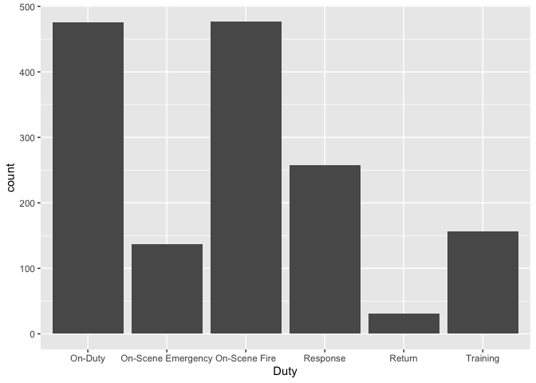
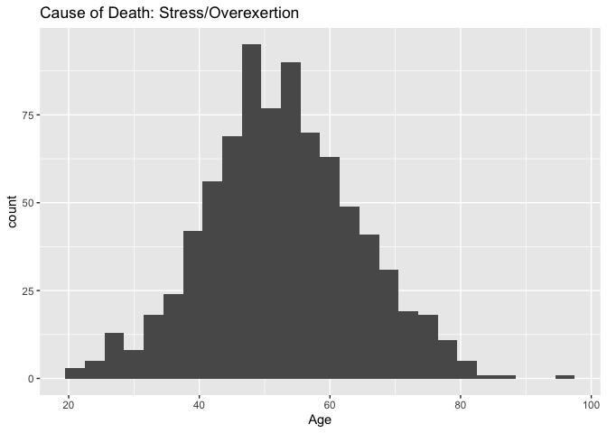
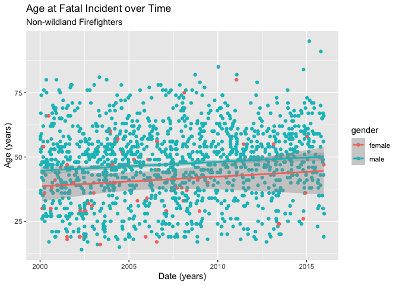

# Data Science 101 - Project 2
by Benfeard Williams, Isabel Decolin, Rene Zhang, and Raul Miranda on 8/20/2020

>This project was for Montgomery College Data Science 101

# Introduction

The data set we chose is Firefighter Fatalities in the United States from Kaggle (https://www.kaggle.com/fema/firefighter-fatalities). This data comes from the U.S. Fire Administration which tracks and collects information on the causes of on-duty firefighter fatalities. Data are reported by individual fire departments, chief fire officers, fire service organizations, the National Fire Protection Association, and the National Fallen Firefighters Foundation. The data set include information on the name, age, rank, date and cause of death, and nine other variables for all firefighters killed between 2000 and 2015.

## Research Questions

- What is the age distribution of dead firefighters?
- What are the most common causes of death?
- Do career firefighters die at a later age than volunteers, in average?
- Is the cause of death correlated with age?
- Do most deaths occur at on-scene fires?
- What is the breakdown of rank and how does that relate to age of death?
- Is gender a factor in age of death?
- What is the historical trend in average age of death?

# Firefighter Fatalities


```r
#Read the data
firefighters <- read.csv("database.csv", na.strings = c(""," ","NA"))    # read and set as NA the empty or space-containing cells

#Structure of the data
str(firefighters) # which is a data frame of 2005 observations and 14 character variables
```

```
## 'data.frame':	2005 obs. of  14 variables:
##  $ First.Name      : chr  "Robert" "Lee" "Ronald" "Allen" ...
##  $ Last.Name       : chr  "Pollard" "Purdy" "Osadacz" "Streeter" ...
##  $ Age             : chr  "64" "57" "36" "58" ...
##  $ Rank            : chr  "Firefighter" "Pump Operator/Inspector" "First Assistant Chief" "Firefighter" ...
##  $ Classification  : chr  "Volunteer" "Volunteer" "Volunteer" "Volunteer" ...
##  $ Date.of.Incident: chr  "Dec 31, 1999" "Jan 8, 2000" "Jan 11, 2000" "Jan 11, 2000" ...
##  $ Date.of.Death   : chr  "Jan 1, 2000" "Jan 8, 2000" "Jan 11, 2000" "Jan 11, 2000" ...
##  $ Cause.Of.Death  : chr  "Stress/Overexertion" "Stress/Overexertion" "Stress/Overexertion" "Stress/Overexertion" ...
##  $ Nature.Of.Death : chr  "Stroke" "Heart Attack" "Heart Attack" "Heart Attack" ...
##  $ Duty            : chr  "Response" "On-Scene Fire" "Response" "On-Scene Fire" ...
##  $ Activity        : chr  "Vehicle Passenger" "Advance Hose Lines/Fire Attack" "Advance Hose Lines/Fire Attack" "Advance Hose Lines/Fire Attack" ...
##  $ Emergency       : chr  "Yes" "Yes" "Yes" "Yes" ...
##  $ Property.Type   : chr  "Outdoor Property" "Residential" "Street/Road" "Outdoor Property" ...
##  $ X               : chr  NA NA NA NA ...
```

```r
#First row
head(firefighters, 1)
```

```
##   First.Name Last.Name Age        Rank Classification Date.of.Incident
## 1     Robert   Pollard  64 Firefighter      Volunteer     Dec 31, 1999
##   Date.of.Death      Cause.Of.Death Nature.Of.Death     Duty          Activity
## 1   Jan 1, 2000 Stress/Overexertion          Stroke Response Vehicle Passenger
##   Emergency    Property.Type    X
## 1       Yes Outdoor Property <NA>
```

```r
#Last row
tail(firefighters, 1)
```

```
##      First.Name Last.Name Age        Rank Classification Date.of.Incident
## 2005    Patrick Wolterman  28 Firefighter         Career     Dec 28, 2015
##      Date.of.Death Cause.Of.Death Nature.Of.Death          Duty
## 2005  Dec 28, 2015       Collapse     Suffocation On-Scene Fire
##                            Activity Emergency Property.Type    X
## 2005 Advance Hose Lines/Fire Attack       Yes   Residential <NA>
```

## Data Description

The data contains information about the firefighter's names, age, rank, classification, the date of their fatal incident, the date of their death, the cause of their death, the nature of their death, whether or not they were on duty, on scene , what type of activity they were doing, if they were handling an emergency, and the property type for the incident.

Potential improvements to the dataset include adding information on gender, location of incident, time in the force. Gender information is added later to the data.

# Data Clean Up and Preparation


```r
library("tidyverse")
```

## Abnormal Entry

We noticed an abnormal observation entry. As shown below, it was row 762, which had empty col 2, Last.Name in col 3, and all subsequent columns shifted to the right. This created an additional column X, that was empty for all rows except for row 762.


```r
firefighters[which(is.na(firefighters$Last.Name)),]      ## which row has Last.Name: "NA";  show the row
```

```
##     First.Name Last.Name     Age Rank  Classification Date.of.Incident
## 762     Nadar       <NA> Hammett   29 Firefighter/EMT           Career
##     Date.of.Death Cause.Of.Death Nature.Of.Death Duty Activity
## 762   Dec 1, 2003    Dec 1, 2003          Impact   No   Trauma
##                             Emergency Property.Type           X
## 762 Personal Vehicle Driver/Passenger      Training Street/Road
```


```r
# remove row 762 and column "X"
#firefighters <- firefighters[-762, c(1:13)]
#str(firefighters) # leaving 2004 records and 13 variables

# Alternatively, search for the incorrect column and then remove the extra column later when select columns useful for analysis
toRemove = c()
for (index in seq_along(firefighters$Last.Name)) {
    lastname <- firefighters$Last.Name[index]
    if (is.na(lastname)){
        toRemove <- c(toRemove, index)
    }
}
toRemove
```

```
## [1] 762
```

```r
firefighters <- firefighters[-toRemove, ]
str(firefighters)
```

```
## 'data.frame':	2004 obs. of  14 variables:
##  $ First.Name      : chr  "Robert" "Lee" "Ronald" "Allen" ...
##  $ Last.Name       : chr  "Pollard" "Purdy" "Osadacz" "Streeter" ...
##  $ Age             : chr  "64" "57" "36" "58" ...
##  $ Rank            : chr  "Firefighter" "Pump Operator/Inspector" "First Assistant Chief" "Firefighter" ...
##  $ Classification  : chr  "Volunteer" "Volunteer" "Volunteer" "Volunteer" ...
##  $ Date.of.Incident: chr  "Dec 31, 1999" "Jan 8, 2000" "Jan 11, 2000" "Jan 11, 2000" ...
##  $ Date.of.Death   : chr  "Jan 1, 2000" "Jan 8, 2000" "Jan 11, 2000" "Jan 11, 2000" ...
##  $ Cause.Of.Death  : chr  "Stress/Overexertion" "Stress/Overexertion" "Stress/Overexertion" "Stress/Overexertion" ...
##  $ Nature.Of.Death : chr  "Stroke" "Heart Attack" "Heart Attack" "Heart Attack" ...
##  $ Duty            : chr  "Response" "On-Scene Fire" "Response" "On-Scene Fire" ...
##  $ Activity        : chr  "Vehicle Passenger" "Advance Hose Lines/Fire Attack" "Advance Hose Lines/Fire Attack" "Advance Hose Lines/Fire Attack" ...
##  $ Emergency       : chr  "Yes" "Yes" "Yes" "Yes" ...
##  $ Property.Type   : chr  "Outdoor Property" "Residential" "Street/Road" "Outdoor Property" ...
##  $ X               : chr  NA NA NA NA ...
```

Now we can format the columns and remove extraneous information that we won't use in the analysis like Last.Name. We'll also get rid of rank which has too many levels without a good method of comparing them.

In order to use the Date of Incident and Date of Death columns as dates in R, we are converting them from strings using the as.Date() function. This will allow us to look at the different between the columns and calculate the number of days after an incident that death occurs.


```r
firefighters2 <- select(firefighters, -c(2, 4))

firefighters2$Age <- sapply(firefighters2$Age, as.integer)
firefighters2$Date.of.Death <- as.Date(firefighters$Date.of.Death, "%b %d, %Y")
firefighters2$Date.of.Incident <- as.Date(firefighters$Date.of.Incident, "%b %d, %Y")

l1 <- c("Classification", "Cause.Of.Death", "Nature.Of.Death", "Duty", "Activity", "Property.Type", "Emergency")
firefighters2[, l1] <- lapply(firefighters2[, l1], factor)

str(firefighters2)
```

```
## 'data.frame':	2004 obs. of  12 variables:
##  $ First.Name      : chr  "Robert" "Lee" "Ronald" "Allen" ...
##  $ Age             : int  64 57 36 58 37 53 52 47 23 74 ...
##  $ Classification  : Factor w/ 8 levels "Career","Industrial",..: 5 5 5 5 5 1 5 5 5 5 ...
##  $ Date.of.Incident: Date, format: "1999-12-31" "2000-01-08" ...
##  $ Date.of.Death   : Date, format: "2000-01-01" "2000-01-08" ...
##  $ Cause.Of.Death  : Factor w/ 13 levels "Assault","Collapse",..: 10 10 10 10 11 10 6 7 7 5 ...
##  $ Nature.Of.Death : Factor w/ 11 levels "Burns","Drowning",..: 7 4 4 4 8 4 9 9 9 8 ...
##  $ Duty            : Factor w/ 6 levels "On-Duty","On-Scene Emergency",..: 4 3 4 3 6 1 1 4 4 3 ...
##  $ Activity        : Factor w/ 22 levels "Advance Hose Lines/Fire Attack",..: 20 1 1 1 9 17 6 19 19 1 ...
##  $ Emergency       : Factor w/ 2 levels "No","Yes": 2 2 2 2 1 1 1 2 2 2 ...
##  $ Property.Type   : Factor w/ 12 levels "Educational",..: 6 8 11 6 5 10 5 11 11 8 ...
##  $ X               : chr  NA NA NA NA ...
```

## Add New Column


```r
firefighters2 <- mutate(firefighters2, Days.After.Incident = Date.of.Death - Date.of.Incident) 
str(firefighters2$Days.After.Incident)
```

```
##  'difftime' num [1:2004] 1 0 0 0 ...
##  - attr(*, "units")= chr "days"
```

## Data cleaning up for factors

Cause of Death, Nature of Death, Property Type, and Activity are strings with a lot of potential answers to organize.


```r
levels(firefighters2$Activity)
```

```
##  [1] "Advance Hose Lines/Fire Attack"    "Emergency Response"               
##  [3] "EMS/Patient Care"                  "Extrication"                      
##  [5] "Fitness Activity"                  "In-Station Duties"                
##  [7] "Incident Command"                  "Not on Scene"                     
##  [9] "Other"                             "Personal Vehicle Driver/Passenger"
## [11] "Pump Operations"                   "Salvage and Overhaul"             
## [13] "Scene Safety"                      "Search and Rescue"                
## [15] "Setup"                             "Standby"                          
## [17] "Support"                           "Unknown"                          
## [19] "Vehicle Driver"                    "Vehicle Passenger"                
## [21] "Ventilation"                       "Water Supply"
```

```r
levels(firefighters2$Cause.Of.Death)
```

```
##  [1] "Assault"             "Collapse"            "Contact"            
##  [4] "Disorientation"      "Exposure"            "Fall"               
##  [7] "Impact"              "Other"               "Smoke"              
## [10] "Stress/Overexertion" "Trapped"             "Unknown"            
## [13] "Vehicle Collision"
```

```r
levels(firefighters2$Nature.Of.Death)
```

```
##  [1] "Burns"           "Drowning"        "Electrocution"   "Heart Attack"   
##  [5] "Heat Exhaustion" "Other"           "Stroke"          "Suffocation"    
##  [9] "Trauma"          "Unknown"         "Violence"
```

```r
levels(firefighters2$Property.Type)
```

```
##  [1] "Educational"      "Industrial"       "Institutional"    "Manufacturing"   
##  [5] "N/A"              "Outdoor Property" "Public Assembly"  "Residential"     
##  [9] "Storage"          "Store/Office"     "Street/Road"      "Vacant Property"
```

# Data Analysis

## Gender Information

Gender  is not part of the dataset, so to answer this question of whether gender is a significant factor, we derived gender from first names. We resort to "gender" and "genderdata" packages described at the links shown below and at www.r-project.org/nosvn/pandoc/gender.html. The function "gender" returns the likely gender of a first name based on historical information, with 97% accuracy for any given year.


```r
library(gender)
library(genderdata)
firefighters3 <- mutate(firefighters2,veryfirstname = word(First.Name))
        # add a column with the first word of the First.Names so that gender() and left_join() are not confused by double first names
name_gender<-gender(firefighters3$veryfirstname, years = c("1932", "2012"), method = "ssa") %>% unique()  # create name_gender list
firefighters2 <- left_join(firefighters3, name_gender[,c(1,4)], by = c("veryfirstname" = "name"))  # join the two dataframes, adding column gender to firefighters2
group_by(firefighters2, gender) %>% summarize(mean_age = mean(as.numeric(Age), na.rm = TRUE), sd_age = sd(as.numeric(Age), na.rm = TRUE), total = n())
```

```
## # A tibble: 3 x 4
##   gender mean_age sd_age total
##   <chr>     <dbl>  <dbl> <int>
## 1 female     39.8   14.2    72
## 2 male       46.6   14.4  1912
## 3 <NA>       47.3   16.7    20
```

## New Subsets

In order to remove bias from the analysis introduced by prominent events on specific dates, we decided to separate the September 11, 2001, firefighters from the rest. We also decided to separate firefighters who handle the Wildlands, who are exposed to different risk factors compared to city firefighters. 


```r
fire_11 <- filter(firefighters2, Date.of.Death == "2001-09-11") 
fire_wild <- filter(firefighters2, str_detect(Classification, "^Wildland"))
fire_main <- filter(firefighters2, Date.of.Death != "2001-09-11" & !str_detect(Classification, "^Wildland"))
dim(fire_11)
```

```
## [1] 343  15
```

```r
dim(fire_wild)
```

```
## [1] 121  15
```

```r
dim(fire_main)  # show the number of rows and columns in each subset
```

```
## [1] 1537   15
```

```r
hist(as.integer(fire_main$Age), main="Age of Death in the Main Firefighter sample", xlab="Age")       # show the distribution of age of death across the main firefighter population
```

<!-- -->


## Is Classification a risk factor for early age fatalities?

Remove NA rows in classification columns and age columns. The question is about career people vs volunteers.


```r
age_class <- select(fire_main, Age, Classification) %>% na.exclude %>% filter(Classification == "Career" | Classification == "Volunteer") %>% arrange(Classification)

group_by(age_class, Classification) %>% summarize(mean_age = mean(as.numeric(Age), na.rm = TRUE), sd_age = sd(as.numeric(Age), na.rm = TRUE), total = n())
```

```
## # A tibble: 2 x 4
##   Classification mean_age sd_age total
##   <fct>             <dbl>  <dbl> <int>
## 1 Career             43.8   10.7   608
## 2 Volunteer          49.3   16.0   864
```

```r
ggplot(fire_main, aes(x=Classification, y=Age)) + geom_boxplot(fill="slateblue", alpha=0.2) + xlab("Career Class")
```

<!-- -->

Observation: career firefighters perish an average of 5.6 years younger than Volunteers. This is likely a consequence of: younger enrollment, higher exposure to risk, but those are not testable hypotheses with this dataset.

## What About the Ages of Wildland Firefighters?


```r
ggplot(fire_wild, aes(x=Age)) + geom_histogram(binwidth = 1)
```

<!-- -->

```r
mean(na.omit(fire_wild$Age))
```

```
## [1] 37.74167
```

```r
sd(na.omit(fire_wild$Age))
```

```
## [1] 14.02189
```

```r
group_by(fire_wild, Classification) %>% summarize(mean_age = mean(as.numeric(Age), na.rm = TRUE), sd_age = sd(as.numeric(Age), na.rm = TRUE), total = n())
```

```
## # A tibble: 3 x 4
##   Classification     mean_age sd_age total
##   <fct>                 <dbl>  <dbl> <int>
## 1 Wildland Contract      45.0  15.7     40
## 2 Wildland Full-Time     39.1  11.5     46
## 3 Wildland Part-Time     27.6   7.83    35
```

## Is Being On Duty Riskier Factor?


```r
ggplot(fire_main, aes(x=Emergency)) + geom_histogram(stat="count")
```

<!-- -->

```r
fire_main %>% drop_na(Duty) %>% ggplot() + geom_histogram(aes(x=Duty), stat = "count")
```

<!-- -->

```r
group_by(fire_main, Duty) %>% summarize(mean_age = mean(as.numeric(Age), na.rm = TRUE), sd_age = sd(as.numeric(Age), na.rm = TRUE), total = n())
```

```
## # A tibble: 7 x 4
##   Duty               mean_age sd_age total
##   <fct>                 <dbl>  <dbl> <int>
## 1 On-Duty                50.3   12.0   476
## 2 On-Scene Emergency     51.3   15.1   137
## 3 On-Scene Fire          44.6   13.4   477
## 4 Response               44.9   18.1   257
## 5 Return                 50.7   12.5    31
## 6 Training               43.8   13.0   157
## 7 <NA>                   42.5   10.6     2
```

```r
ggplot(fire_main) + aes(x = Duty, fill = factor(Classification)) + geom_bar(position = "fill") + coord_flip() + ggtitle("Firefighter Fatalities Based On Duty By Classifications")
```

<!-- -->

## What Is The Leading Cause of Death?


```r
group_by(fire_main, Cause.Of.Death) %>% summarize(mean_age = mean(as.numeric(Age), na.rm = TRUE), sd_age = sd(as.numeric(Age), na.rm = TRUE), total = n())
```

```
## # A tibble: 14 x 4
##    Cause.Of.Death      mean_age sd_age total
##    <fct>                  <dbl>  <dbl> <int>
##  1 Assault                 41.8  14.3      4
##  2 Collapse                39.0  11.6     44
##  3 Contact                 38.5   3.54     2
##  4 Disorientation          37.2  12.2     13
##  5 Exposure                47.2  15.4     23
##  6 Fall                    47.4  16.3     65
##  7 Impact                  40.2  14.6    202
##  8 Other                   45.4  14.2     41
##  9 Smoke                   47.2  10.2      4
## 10 Stress/Overexertion     52.6  11.7    820
## 11 Trapped                 37.0  10.2    142
## 12 Unknown                 57     9.59     4
## 13 Vehicle Collision       39.8  16.1    164
## 14 <NA>                    39.9  10.6      9
```

```r
stress <- filter(fire_main, Cause.Of.Death == "Stress/Overexertion")
ggplot(stress, aes(x=Age)) + geom_histogram(binwidth=3) + ggtitle("Cause of Death: Stress/Overexertion")
```

<!-- -->

```r
top_4_cause <- filter(fire_main, Cause.Of.Death == c("Stress/Overexertion", "Impact", "Vehicle Collision", "Trapped"))
ggplot(top_4_cause, aes(x=Cause.Of.Death, y=Age)) + geom_boxplot(fill="slateblue", alpha=0.2) + ggtitle("Top 4 Causes of Death")
```

<!-- -->


## Time and Date Analysis: are there any temporal trends?

We first looked out how long firefighters stay alive after their fatal incident and checked to see if this was age dependent. During this analysis, we discovered 4 data entries that claim firefighters died one day before their fatal incidents. We believe the Date.of.Incident and Cause.of.Death columns were mistakenly swapped.


```r
fire_main %>% select(Age, Days.After.Incident) %>% na.omit() %>% ggplot(aes(x=Age, y=Days.After.Incident)) + geom_point() + geom_smooth(method = lm) + ggtitle("Age vs Days Surviving After Fatal Incident") + xlab("Age (years)") + ylab("Surviving Days After Fatal Incident")
```

<!-- -->

```r
head(fire_main %>% group_by(Days.After.Incident) %>% summarize(total = n()))
```

```
## # A tibble: 6 x 2
##   Days.After.Incident total
##   <drtn>              <int>
## 1 -1 days                 4
## 2  0 days              1154
## 3  1 days               142
## 4  2 days                38
## 5  3 days                26
## 6  4 days                15
```

```r
fire_main %>% filter(Days.After.Incident == -1) %>% select(1:5)
```

```
##   First.Name Age Classification Date.of.Incident Date.of.Death
## 1    Michael  55      Volunteer       2007-08-15    2007-08-14
## 2    William  58      Volunteer       2009-02-01    2009-01-31
## 3    Timothy  42      Volunteer       2009-08-08    2009-08-07
## 4      James  59      Volunteer       2015-06-04    2015-06-03
```

We found no correlation between a firefighter's age and how long they survive after an incident on the job. The only conclusion we could make is that outliers in the data tend to be above the age of 50. The data shows that 75% of the deaths occur the same day and quickly decreases to 9% of the deaths occuring 1 day later.


```r
x <- fire_main$Age
y <- as.numeric(fire_main$Days.After.Incident)
model <- lm(y~x)
summary(model)
```

```
## 
## Call:
## lm(formula = y ~ x)
## 
## Residuals:
##     Min      1Q  Median      3Q     Max 
##  -127.4   -65.8   -47.9   -28.0 12081.3 
## 
## Coefficients:
##             Estimate Std. Error t value Pr(>|t|)  
## (Intercept) -43.5785    46.3330  -0.941   0.3471  
## x             1.9885     0.9428   2.109   0.0351 *
## ---
## Signif. codes:  0 '***' 0.001 '**' 0.01 '*' 0.05 '.' 0.1 ' ' 1
## 
## Residual standard error: 525.1 on 1515 degrees of freedom
##   (20 observations deleted due to missingness)
## Multiple R-squared:  0.002928,	Adjusted R-squared:  0.00227 
## F-statistic: 4.449 on 1 and 1515 DF,  p-value: 0.03509
```

Next, we asked if there is a relationship between the age of firefighters and the date of fatal incidents. Are fire departments improving risk for younger or newer firefighters? In our analysis, we found outliers that died after 2000 but their incidents occured before 2000. To keep our dataset in the range of 2000-2015 for all our data points, we excluded these rows. We added a linear regression model to look for a trend.


```r
ggplot(fire_main, aes(x=Date.of.Incident, y=Age)) + geom_point()
```

<!-- -->

```r
fire_main %>% drop_na(gender) %>% filter(Date.of.Incident >= as.Date("2000-01-01")) %>%ggplot(aes(x=Date.of.Incident, y=Age, color=gender)) + geom_point() + geom_smooth(method=lm) + labs(title = "Age at Fatal Incident over Time", subtitle = "Non-wildland Firefighters") + xlab("Date (years)") + ylab("Age (years)")
```

<!-- -->

```r
fire_wild %>% drop_na(gender) %>% filter(Date.of.Incident >= as.Date("2000-01-01")) %>% ggplot(aes(x=Date.of.Incident, y=Age, color=gender)) + geom_point() + geom_smooth(method=lm) + labs(title = "Age at Fatal Incident over Time", subtitle = "Wildland Firefighters") + xlab("Date (years)") + ylab("Age (years)")
```

<!-- -->

Both the Wildland and non-Wildland firefighters have weak trends over time. Females and males have same trends, with females dying at an earlier age. With non-Wildland firefighters, there is a weak upward trend line suggesting that the fighters may experience fatal incidents at a higher age. This could mean the firefighters are more experienced and have received more training allowing them to live longer. The Wildland firefighters have a weak downward trend which is most likely biased by several young firefighters dying during the Yarnell Hill Fire on June 30th, 2013.

Next, we wanted to take a deeper look into these trends by analyzing the number of deaths per year for Wildland and non-Wildland firefighters.


```r
fire_main %>% drop_na(Date.of.Incident) %>% ggplot() + geom_histogram(aes(x=format(Date.of.Death, "%Y")), stat = "count") + labs(title = "Fatalities over Time", subtitle = "Non-wildland Firefighters") + xlab("Year") + ylab("Total Deaths")
```

<!-- -->

```r
fire_wild %>% drop_na(Date.of.Incident) %>% ggplot() + geom_histogram(aes(x=format(Date.of.Death, "%Y")), stat = "count") + labs(title = "Fatalities over Time", subtitle = "Wildland Firefighters") + xlab("Year") + ylab("Total Deaths")
```

<!-- -->

We conclude that non-Wildland firefighters have seen a slight decrease in total deaths when comparing the 2000-2008 and 2009-2015. Wildland firefighters show no trends over the years. The data does highlight that the Yarnel Hill Fire was a significant event for Wildland firefighters.
